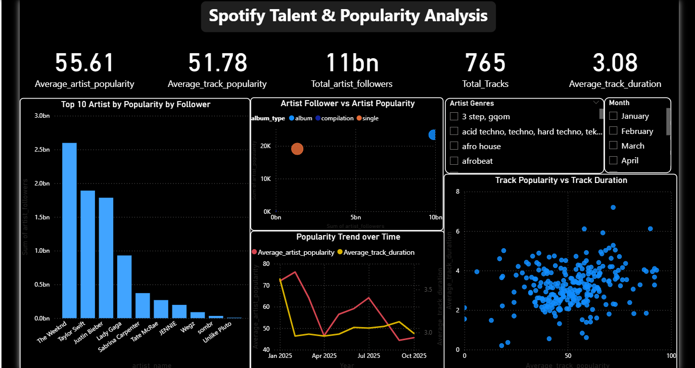
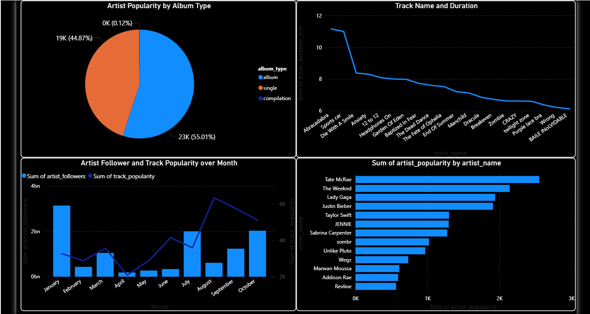
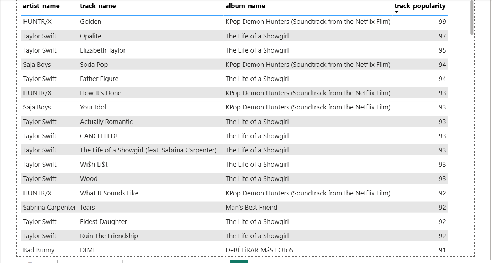

# Spotify-Data-Analysis
🎵 Power BI dashboard analyzing Spotify artist and track data. Insights on 11B+ followers, 765 tracks, popularity trends, and genre performance. Interactive Power BI dashboard exploring Spotify music data - artist popularity, follower analysis, track characteristics, and temporal trends. 

# Spotify-Data-Analysis
🎵 Power BI dashboard analyzing Spotify artist and track data. Insights on 11B+ followers, 765 tracks, popularity trends, and genre performance. Interactive Power BI dashboard exploring Spotify music data - artist popularity, follower analysis, track characteristics, and temporal trends. 
# 🎵 Spotify Talent & Popularity Analysis Dashboard

## 📊 Project Overview
This project presents a comprehensive analysis of **Spotify artist and track data** using **Power BI**. The dashboard explores artist popularity, follower counts, track characteristics, genre trends, and temporal patterns to uncover insights about what drives success on the Spotify platform.

## 🎯 Problem Statement
Understanding what makes artists and tracks successful on Spotify is crucial for music industry stakeholders. This analysis aims to answer key questions about:
- Artist popularity and follower relationships
- Track characteristics that drive engagement
- Genre preferences and trends
- Temporal patterns in music consumption
- Album type performance metrics

## 📈 Dashboard Preview




## 🔍 Key Business Questions Answered

1. **Who are the top artists by popularity and by followers?**
2. **Is there a clear relationship between an artist's follower count and their "popularity" score?**
3. **What are the characteristics of popular tracks?** (e.g., is track popularity linked to duration? Is explicit content more popular?)
4. **How has artist and track popularity trended over time?**
5. **What are the most popular genres?**

## 📊 Key Insights

### Overall Metrics
- **Average Artist Popularity**: 55.61
- **Average Track Popularity**: 51.78
- **Total Artist Followers**: 11 billion
- **Total Tracks Analyzed**: 765
- **Average Track Duration**: 3.08 minutes

### Top 10 Artists by Followers
1. **The Weeknd** - Leading with highest follower count
2. **Taylor Swift** - Strong second position
3. **Justin Bieber** - Major presence
4. **Lady Gaga** - Consistent popularity
5. **Sabrina Carpenter** - Rising star
6. **Tate McRae** - Growing following
7. **JENNIE** - K-pop representation
8. **Wegz** - Regional popularity
9. **sombr** - Emerging artist
10. **Unlike Pluto** - Niche following

### Most Popular Tracks
- **"Golden"** by HUNTR/X - 99 popularity score (KPop Demon Hunters Soundtrack)
- **"Opalite"** by Taylor Swift - 97 popularity score
- **"Elizabeth Taylor"** by Taylor Swift - 95 popularity score
- **"Soda Pop"** by Saja Boys - 94 popularity score
- **"Father Figure"** by Taylor Swift - 94 popularity score

### Album Type Performance
- **Album releases**: 55.01% (23K)
- **Singles**: 44.87% (19K)
- **Compilations**: 0.12% (minimal presence)

### Genre Insights
Popular genres identified include:
- **3 step, gqom**
- **Acid techno, techno, hard techno**
- **Afro house**
- **Afrobeat**
- Various electronic and global music styles

### Temporal Trends
- **Follower growth** peaks during specific months (February, October)
- **Track popularity** shows seasonal variations
- **Average duration** remains relatively stable around 3.0-3.5 minutes
- Clear correlation between artist activity and popularity spikes

### Key Findings
1. **Follower-Popularity Correlation**: Strong positive relationship exists between follower count and popularity score
2. **Track Duration Sweet Spot**: Popular tracks average around 3 minutes
3. **Album vs Single**: Albums slightly outperform singles in artist popularity
4. **Genre Diversity**: Electronic and global music genres show strong representation
5. **Temporal Patterns**: Clear monthly variations in engagement metrics

## 🛠️ Tools & Technologies Used
- **Power BI Desktop** - Dashboard creation and data visualization
- **DAX (Data Analysis Expressions)** - Custom calculations and measures
- **Power Query** - Data transformation and cleaning
- **Data Modeling** - Relationship management
- **Interactive Visualizations** - Slicers, filters, and drill-through functionality

## 📁 Project Structure
```
Spotify-Data-Analysis/
│
├── 📂 dashboards/
│   ├── Spotify Data Analysis.pbix
│   ├── Spotify Data Analysis (2).pbix
│   └── Spotify Data Analysis (3).pbix
│
├── 📂 data/
│   ├── spotify_data_clean.xlsx
│   └── track_data_final.xlsx
│
├── 📂 documentation/
│   ├── Spotify Data Analysis PDF.pdf
│   └── Problem Statements.txt
│
├── 📂 screenshots/
│   ├── dashboard-page1.png
│   ├── dashboard-page2.png
│   └── dashboard-page3.png
│
├── 📂 demo/
│   └── Video.mp4
│
└── README.md
```

## 🚀 How to Use

1. **Download the Repository**
   ```bash
   git clone https://github.com/lileshwar-mahajan/Spotify-Data-Analysis.git
   ```

2. **Open the Power BI File**
   - Ensure you have **Power BI Desktop** installed ([Download here](https://powerbi.microsoft.com/desktop/))
   - Open `Spotify_Analysis.pbix`

3. **Explore the Dashboard**
   - Navigate through multiple pages using page tabs at the bottom
   - Use slicers to filter by:
     - Artist genres
     - Month
     - Album type
   - Hover over visuals for detailed tooltips
   - Click on data points for cross-filtering

4. **Interact with Visuals**
   - Click on any artist name to filter related data
   - Use the genre and month filters for specific analysis
   - Drill down into specific metrics for deeper insights

## 💡 Key Features

- **Multi-Page Dashboard**: Three comprehensive pages covering different aspects
- **Interactive Filters**: Genre, month, and album type slicers
- **Dynamic Visualizations**: Bar charts, line graphs, scatter plots, pie charts
- **KPI Cards**: Quick view of key metrics at the top
- **Cross-Filtering**: Click any visual to filter others
- **Relationship Analysis**: Scatter plots showing correlations
- **Time Series Analysis**: Trend analysis over months
- **Top N Analysis**: Focus on top performers

## 📌 Business Recommendations

Based on the analysis:

1. **For Artists**:
   - Target 3-minute track duration for optimal engagement
   - Focus on album releases for higher popularity scores
   - Maintain consistent release schedule during peak months

2. **For Record Labels**:
   - Invest in artists showing follower growth momentum
   - Prioritize album production over single releases
   - Leverage soundtrack opportunities (high popularity observed)

3. **For Spotify**:
   - Promote emerging genres like afrobeat and gqom
   - Feature artists with high follower-to-popularity ratios
   - Optimize recommendation algorithms for 3-minute tracks

4. **For Marketing**:
   - Focus campaigns during February and October peaks
   - Highlight popular artists in cross-promotion strategies
   - Target genre-specific audiences with tailored content

## 📚 Data Insights Summary

### Artist Performance
- Strong correlation between followers and popularity
- Top artists dominate with billion+ follower counts
- Taylor Swift shows consistent high track popularity across albums

### Track Characteristics
- Optimal duration: ~3 minutes
- Soundtrack releases show exceptional performance
- Single releases compete closely with album tracks

### Temporal Patterns
- Clear monthly seasonality in engagement
- Consistent artist popularity across 2025
- Track duration remains stable industry-wide

## 🎓 Learning Outcomes

This project demonstrates proficiency in:
- Power BI dashboard design and development
- DAX measure creation and calculation
- Data modeling and relationship management
- Interactive visualization techniques
- Business intelligence and analytics
- Data storytelling and insight generation

## 📧 Contact

For any questions or feedback regarding this project, please feel free to reach out!

**Your Name**
- GitHub: [@lileshwar-mahajan](https://github.com/lileshwar-mahajan)
- LinkedIn: [www.linkedin.com/in/lileshwar-mahajan-b81137255](www.linkedin.com/in/lileshwar-mahajan-b81137255)
- Email: mahajanlileshwar@gmail.com

## ⭐ Acknowledgments

- Spotify data source for providing comprehensive music analytics
- Power BI community for visualization inspiration
- Music industry insights from various sources

---

**If you find this project helpful, please consider giving it a ⭐ and sharing it with others!**

## 🔗 Related Projects

Check out my other data analysis projects:
- [FNP Sales Analysis](https://github.com/lileshwar-mahajan/FNP-Sales-Analysis)
